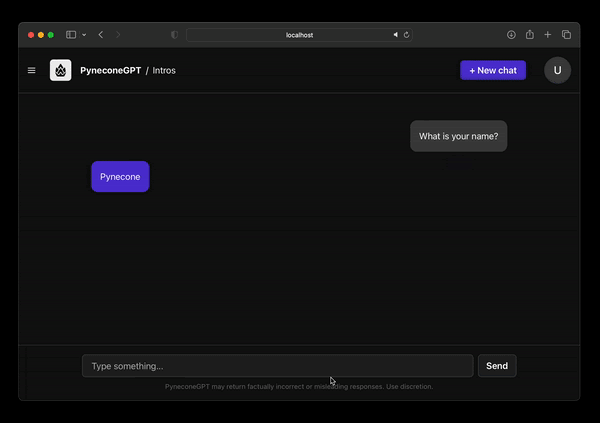

# Breogan — Chat Tutor

A user-friendly, highly customizable Python web app designed as a Galician tutor interface.

<div align="center">

</div>

# Getting Started

If you later want to connect an LLM backend, save any API keys securely as environment variables.

### 🧬 1. Clone the Repo

```bash
git clone https://github.com/reflex-dev/reflex-chat.git
```

### Instalación y ejecución

- Python 3.10+
- Instala las dependencias de Python:

```bash
pip install -r requirements.txt
```

Arranca la aplicación con tu CLI de Reflex (`reflex run`) o con la herramienta que uses para tu entorno. Si no usas Reflex, adapta las instrucciones a tu entorno.

# Features

- Frontend-first Galician tutor UI
- Create and delete chat sessions
- Responsive design for various devices

# Contributing

We welcome contributions to improve and extend the LLM Web UI.
If you'd like to contribute, please do the following:

- Fork the repository and make your changes.
- Once you're ready, submit a pull request for review.

# License

The following repo is licensed under the MIT License.
